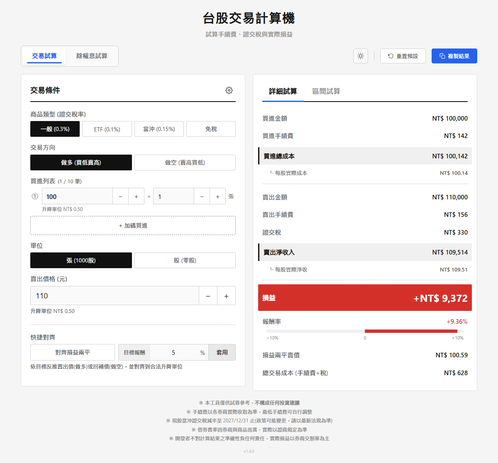
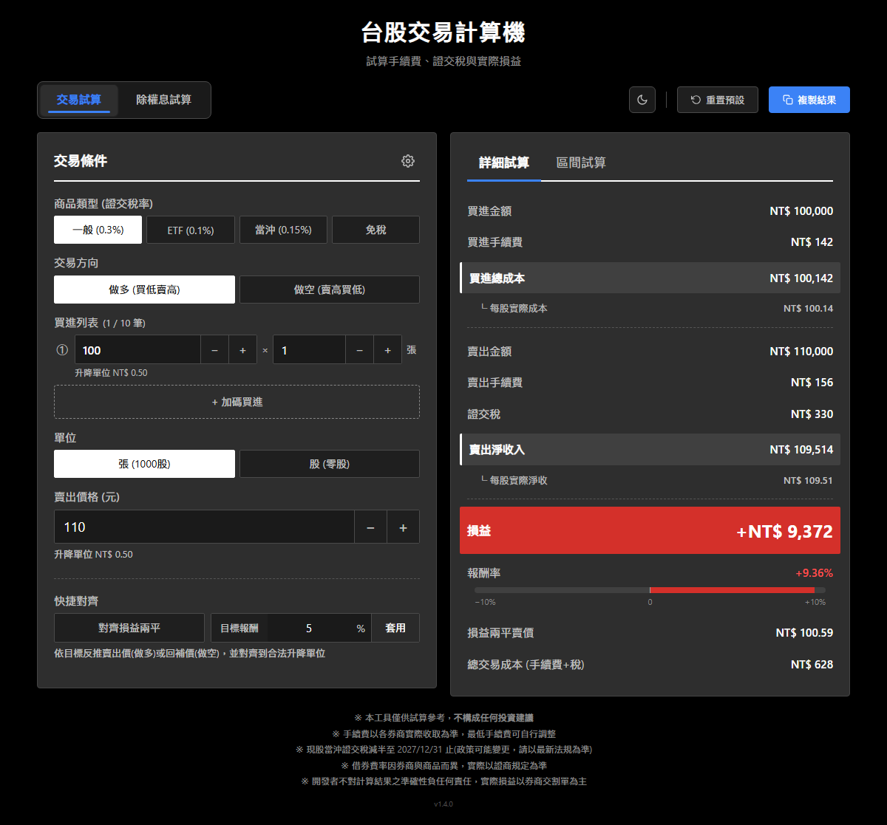

# 📈 台股交易計算機

[](CHANGELOG.md)
[](LICENSE)
[](#%EF%B8%8F-開發)

純前端、零依賴、零追蹤的台股試算工具，把實務上會踩到的細節(手續費折扣、借券費、二代健保補充保費、股利所得稅 A/B 方案……)算完整，並且把結果一次攤平給你看。

頂部一個切換鈕，左邊是「交易試算」(算手續費、證交稅、損益、損益兩平)，右邊是「除權息試算」(算除權息參考價、配股配息、填權息、股利所得稅)。兩種模式各自獨立輸入與儲存，互不污染。

> 🔗 **線上版**：https://muzsor.github.io/twstock-calc/
>
> 📋 **變更紀錄**：[CHANGELOG.md](CHANGELOG.md)

## 📸 預覽

| ☀ 淺色模式 | 🌙 深色模式 |
|:---:|:---:|
|  |  |

## 📑 目錄

- [✨ 功能總覽](#-功能總覽)
- [🧮 模式一：交易試算](#-模式一交易試算)
- [💰 模式二：除權息試算](#-模式二除權息試算)
- [📐 計算公式](#-計算公式)
- [🛠️ 開發](#%EF%B8%8F-開發)
- [🔒 隱私](#-隱私)
- [⚠️ 免責聲明](#%EF%B8%8F-免責聲明)
- [📄 授權](#-授權)

---

## ✨ 功能總覽

兩種主要模式，共用同一套主題與行動裝置體驗：

- 🧮 **交易試算** — 算手續費、證交稅、借券費，反推損益兩平與目標報酬價;支援做多/做空、多筆加碼/回補
- 💰 **除權息試算** — 算除權息參考價、配股配息、填權息所需漲幅、二代健保補充保費(含股票股利合併計算)、除權息後持有成本變化,以及股利所得稅的「合併課稅 vs 分離課稅」擇優建議

跨模式共用的東西：

- 🎨 三種主題(跟隨系統 / 淺色 / 深色)，點右上角單一圖示按鈕循環切換，選擇會記憶下來
- 💾 設定全部 per-origin 存在 localStorage，重整或重開瀏覽器後接續上次的試算
- 📱 PWA — 首次造訪後完全離線可用，可加到主畫面變獨立 app
- ⌨️ 完整鍵盤可訪問 + ARIA + 數字欄位可滾輪微調

---

## 🧮 模式一：交易試算

左卡固定顯示「交易條件」，右卡用分頁切「詳細試算 / 區間試算」。所有條件變動會即時重算兩個分頁的結果。

### 🎯 交易條件

做多時看到「買進列表」，做空時自動改成「回補列表」並多出借券費欄位。其餘輸入兩個方向共用：

- 商品類型：**一般 (0.3%) / ETF (0.1%) / 當沖 (0.15%) / 免稅**
- 多筆加碼/回補 **1~10 筆**，每筆獨立輸入價格與數量，共用全域折扣/商品類型，自動算加權平均成本
- 手續費折扣自訂(快捷：原價 / 6 / 5 / 3.8 / 2.8 折)、最低手續費自訂(預設 20 元)
- 融券借券費 = **成交金額 × 年化費率 × 持有天數 / 365**
- **快捷對齊** — 一鍵把賣價或回補價對齊到「損益兩平」或任意「目標報酬率」

<details>
<summary>📋 詳細試算分頁顯示哪些東西</summary>

買進側：成交金額、手續費、總成本、每股實際成本。

賣出側：成交金額、手續費、證交稅、(做空才有的)借券費、淨收入、每股實際淨收。

底部結論區：損益、報酬率(含 ±10% 視覺化進度條，紅綠依台股慣例)、損益兩平價、總交易成本。

</details>

<details>
<summary>📊 區間試算分頁怎麼用</summary>

以**賣出價(做多)** 或 **回補價(做空)** 為中心，上下展開損益試算表。範圍預設 ±5 個升降單位(11 列)，齒輪 popover 內可切 ±5 / ±10 / ±20。

- 摘要列出固定側金額(買進總成本 / 放空淨收入)、損益兩平、中心價損益
- 中心列用金色高亮，正/負損益以台股慣例上紅下綠
- 切換商品類型/折扣/方向時表格立即重算
- 與詳細試算共用同一套計算，中心列損益必然等於詳細試算分頁的結果

</details>

---

## 💰 模式二：除權息試算

左卡輸入除權息條件、右卡列出試算結果，獨立 layout 與獨立 localStorage，不會跟交易試算的數值打架。

### 💵 除權息條件

主要欄位：

- 除權息前股價
- 現金股利、股票股利(各自可填 0，純除權或純除息都支援)
- 持股數量(獨立的「張/股」單位，不跟交易模式共用)
- **我的買進成本(每股,選填)** — 填了才會試算除權息後成本如何下降

齒輪 popover 內的進階設定：

- **二代健保補充保費率**(預設 2.11%,110 年(2021)起施行)
- **補充保費起徵點**(預設 20,000 元,現金股利 + 股票股利(按面額)合計達此金額才扣)
- **股利以外綜合所得淨額**(用於精算股利所得稅的邊際稅率)

### 🧾 試算結果

依「股價變化」與「我會拿到什麼」兩大群組排版:

**股價變化**

- **除權息參考價** + 股價蒸發金額
- **填權息**:所需漲幅 + 目標價(= 除權息前股價)
- **殖利率**:現金 / 股票 / 合計(以面額計)

**我會拿到什麼**

- **現金股利收入** + 二代健保補充保費(現金 + 股票股利合併計算,達 2 萬門檻才扣)/ **實領現金**(金色強調 — 真正能入袋的金額)
- **配股後總股數**:整股 + 畸零股(小數)拆解,並提示畸零股換現金以發行公司公告為準
- **除權息後總持有成本**(填了買進成本才出現):新總成本 + 每股新成本 + 降低幅度;讓投資人看到配息配股後資金實質佔用變化

**股利所得稅**

- **A. 合併課稅(8.5% 抵減,上限 8 萬)** vs **B. 分離課稅(28%)**,以累進稅率精算「股利造成的額外稅」,自動標示推薦方案,A 案抵減 > 應納稅時顯示退稅(負值)

---

## 📐 計算公式

<details>
<summary>🧾 交易計算</summary>

| 項目 | 公式 | 備註 |
|---|---|---|
| 手續費 | `成交金額 × 0.1425% × 折數`，無條件捨去，最低 20 元 | 法定上限 |
| 證交稅 | `成交金額 × 稅率`，無條件捨去 | 僅賣方繳 |
| 借券費 | `成交金額 × 年化費率 × 天數 / 365`，無條件捨去 | 僅融券放空 |
| 淨收入 | `賣出金額 - 賣出手續費 - 證交稅 - 借券費` | |
| 總成本 | `買進金額 + 買進手續費` | |
| 損益 | `淨收入 - 總成本` | |
| 報酬率 | 做多：`損益 / 總成本`<br>做空：`損益 / 放空名目` | 做空用名目避免空手抓比例 |

</details>

<details>
<summary>📐 損益兩平價反推</summary>

當賣方手續費按比例計算大於最低手續費時：

- **做多**：`breakeven = totalCost / (shares × (1 − feeRate × discount − taxRate))`
- **做空**：`breakeven = netSell / (shares × (1 + feeRate × discount))`

若按比例會低於最低手續費，改用 `minFee` 反推。

</details>

<details>
<summary>📊 區間試算公式</summary>

每一列都使用與詳細試算相同的完整公式(雙邊手續費 + 證交稅 + 借券費)，只是讓「變動側」的價格隨著表格列上下移動：

- **做多**：固定買進價，變動賣出價(中心 = `sellPrice`)
- **做空**：固定放空價，變動回補價(中心 = `buyPrice`)

由於共用公式，中心列的損益會等於詳細試算分頁的結果。

</details>

<details>
<summary>📈 升降單位 (Tick)</summary>

| 股價區間 | 一般股票 | ETF |
|---|---|---|
| < 10 元 | 0.01 | 0.01(< 50) |
| 10–50 | 0.05 | 0.01(< 50) |
| 50–100 | 0.10 | 0.05(≥ 50) |
| 100–500 | 0.50 | 0.05 |
| 500–1000 | 1.00 | 0.05 |
| ≥ 1000 | 5.00 | 0.05 |

</details>

<details>
<summary>💸 除權息公式</summary>

| 項目 | 公式 | 備註 |
|---|---|---|
| 除權息參考價 | `(除權息前股價 − 現金股利) / (1 + 股票股利 / 10)` | 面額 10 元基準 |
| 配股後股數 | `持股 × (1 + 股票股利 / 10)` | 1 元股票股利 = 配 0.1 股 |
| 填權息漲幅 | `(除權息前股價 / 參考價 − 1) × 100%` | 目標 = 回到除權息前股價 |
| 現金/股票殖利率 | `股利 / 除權息前股價 × 100%` | 以面額計 |
| 二代健保補充保費 | `round(feeBase × 2.11%)`,其中 `feeBase = min(現金 gross + 股票面額 gross, 1,000 萬)`,合計 ≥ 20,000 才扣 | 依健保署規定:同一基準日現金 + 股票股利視為「同一次給付」,合併計算;股票股利按每股面額 10 元計 |

</details>

<details>
<summary>🏛️ 股利所得稅(擇優課稅)</summary>

兩方案取較少者：

- **A. 合併課稅**：`股利導致的累進稅增加額 − min(股利 × 8.5%, 80,000)`，以累進稅率精算(含跨級距);抵減大於增加稅可退稅
- **B. 分離課稅**：`股利 × 28%`

採用台灣 2024 年度綜所稅級距(5% / 12% / 20% / 30% / 40% / 45%)，實際申報以財政部試算為準。

</details>

---

## 🛠️ 開發

純前端、零依賴、零建置步驟。HTML / CSS / JS 三層完全分離：

| 檔案 | 用途 |
|---|---|
| `index.html` | 結構標記與 `<head>` 內 FOUC 防止 inline script(設定 `data-theme` / `data-app-mode`) |
| `styles.css` | 所有樣式 |
| `app.js` | 主應用邏輯：純計算函數、UI 渲染、事件、持久化、PWA 註冊 |
| `sw.js` | Service Worker(cache-first、同源限定) |
| `tests.html` | 完整單元測試覆蓋(iframe 載入 `index.html`，讀 `window.__calc`) |

<details>
<summary>🚀 本機啟動</summary>

任何靜態 server 都可以，例如 Python 內建的：

```bash
python -m http.server 8765
# 然後開 http://localhost:8765/
```

或直接以 `file://` 協議開啟 `index.html`(`navigator.clipboard` 在 file:// 下會 fallback 到 `execCommand`，Service Worker 在 file:// 下會自動跳過)。

</details>

<details>
<summary>📱 PWA(加到主畫面)</summary>

線上版(HTTPS)或本機 http server 下，瀏覽器會自動註冊 Service Worker：

- **Android Chrome**：網址列出現「安裝」icon → 加到桌面變獨立 app
- **iOS Safari**：「分享 → 加到主畫面」
- **離線可用**：首次造訪後完全離線(cache-first)

</details>

<details>
<summary>🔢 版本管理</summary>

- 版本號採 [Semantic Versioning](https://semver.org/lang/zh-TW/)，變更記錄於 [CHANGELOG.md](CHANGELOG.md)
- 改版需：① 更新 `app.js` 的 `const APP_VERSION`，② 同步 `index.html` 內兩處 `?v=` query(`styles.css?v=` 與 `app.js?v=`)
- SW 偵測到版本變動會自動清舊 cache + 立即接管
- footer 右下顯示當前版本號

</details>

<details>
<summary>🧪 單元測試</summary>

開啟 [tests.html](tests.html) 即可看到 完整單元測試覆蓋的執行結果。

測試透過 `<iframe>` 載入 `index.html`，讀取 `window.__calc` 暴露的純函數來驗證計算邏輯：

- **交易**：`fmtMoney` / `calcFee` / `calcSide` / `calcMultiBuy` / `calcBreakeven` / `calcTargetPrice` / `snapPriceToTick` / `getTickSize` / `calcScenarioProfit`
- **除權息**：`calcExDividendPrice` / `calcCashDividendIncome` / `calcStockDividendShares` / `calcFillDividendGain` / `calcDividendYield` / `calcCostReduction` / `calcProgressiveTax` / `calcDividendTax`

UI 互動部分(reset / copy / snap 按鈕、localStorage 持久化、滾輪、方向切換、Tab 切換、商品類型按鈕、模式切換)需手動驗證。

</details>

---

## 🔒 隱私

本工具 **完全在瀏覽器本機運作**：

- 🚫 沒有任何 fetch / XHR / WebSocket — 計算結果不離開瀏覽器
- 🚫 沒有 analytics、tracking、cookies
- 🚫 沒有第三方 CDN 依賴(連 favicon 都是 inline SVG)
- 🚫 Service Worker 只快取本地資源(`index.html` / `styles.css` / `app.js` / `tests.html` / `manifest.json` / `icons/icon.svg`)，**跨域請求一律跳過、不代理**
- ✅ localStorage 是 per-origin，使用者輸入只存在自己的瀏覽器

---

## ⚠️ 免責聲明

本工具僅供試算參考，**不構成任何投資建議**。

- 手續費以各券商實際收取為準，可能因服務方案、電子下單而異
- 稅率、費率依政府法規，如有變動請以最新版本為準
- 借券費率與計算方式因券商與商品而異
- 二代健保補充保費率、綜所稅級距以衛福部 / 財政部最新公告為準
- 程式可能存在 bug，實際損益請以券商交割單為主
- 開發者不對計算結果之準確性或使用後果負任何責任

軟體依 [MIT License](LICENSE) 之 "AS IS" 條款提供，不附帶任何明示或暗示之擔保。

---

## 📄 授權

[MIT](LICENSE)
